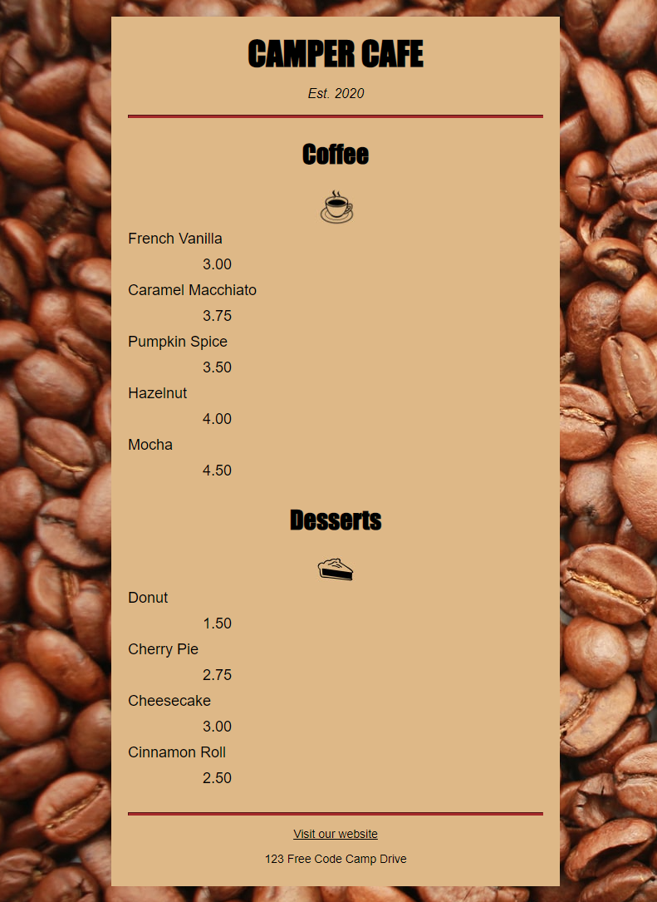

# fcc cafe menu

> Using HTML/CSS tags by building cafe menu.



## Built With

- HTML5 elements
  - `h1`, `div`, `button`, -`h2`, `feader`, `section`.

## Live Demo

[Live Demo Link](https://cafemenu-oladele.netlify.app/)

### Development (Running locally)

- git Clone git@github.com:olayinka-oladele/02-fcc-cafe-menu.git

````

- Install Dependencies

```bash
yarn install
````

To run StyleLint by itself, you may run the lint task:

```bash
yarn lint:check
```

Or to automatically fix issues found (where possible):

```bash
yarn lint
```

You can also check against Prettier:

```bash
yarn format:check
```

and to have it fix (to the best of its ability) any format issues, run:

```bash
yarn format
```

You can also check against Webhint:

```bash
yarn hint
```

## Style Guides

- [CSS Style Guide](http://udacity.github.io/frontend-nanodegree-styleguide/css.html)
- [HTML Style Guide](http://udacity.github.io/frontend-nanodegree-styleguide/index.html)
- [JavaScript Style Guide](http://udacity.github.io/frontend-nanodegree-styleguide/javascript.html)
- [Git Style Guide](https://udacity.github.io/git-styleguide/)

## 👤 Author

- Github: [@olayinka-oladele](https://github.com/author)
- Twitter: [@author](https://twitter.com/author)
- Linkedin: [@olayinka-oladele](https://www.linkedin.com/in/olayinka-oladele/)

## 🤝 Contributing

Contributions, issues and feature requests are welcome!

Feel free to check the [issues page](../../issues).

## Show your support

Give a ⭐️⭐️⭐️⭐️⭐️⭐️ if you like this project!

## Acknowledgments

- Hat tip to anyone whose code was used
- Inspiration, resources/assets used
- etc

## 📝 License

[MIT licensed](./LICENSE).
